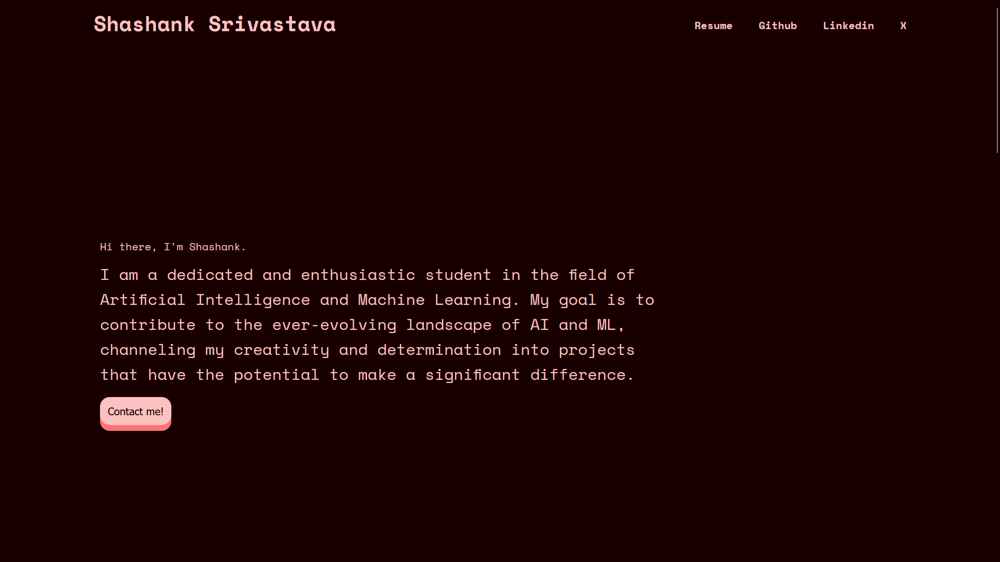

# Portfolio Website

## Description

This is my personal portfolio website showcasing my projects, skills, and experiences. The website is hosted using GitHub Pages.

## Features

- Detailed information about my background, skills, and experiences.
- Showcase of projects I have worked on.
- Contact information and links to my social media profiles.
- Responsive design for optimal viewing on various devices.

## Technologies Used

- HTML5
- CSS3
- JavaScript
  
## Installation

No installation is required for this project.

## Contributing

Contributions are welcome! If you find a bug or want to enhance the website, feel free to open an issue or submit a pull request.

## License

This project is open source and available under the [MIT License](LICENSE).

